# GitOps Validator

A comprehensive validation tool for GitOps repositories that checks for common issues in Flux and Kubernetes configurations. Features configurable error handling and exit codes for seamless GitHub Actions integration.

## Features

- **Flux Kustomization Validation**: Validates Flux Kustomization resources for broken path and source references (paths must be relative to repository root)
- **Kubernetes Kustomization Validation**: Validates kustomization.yaml files for broken resource and patch references (paths relative to kustomization file)
- **Orphaned Resource Detection**: Identifies YAML files that are not referenced by any kustomization
- **Deprecated API Detection**: Warns about usage of deprecated Kubernetes API versions
- **Dependency Chart Generation**: Visualize your GitOps repository structure with Mermaid diagrams
- **Smart Error Handling**: Configurable exit codes for different severity levels (errors, warnings, info)
- **GitHub Actions Integration**: Ready-to-use workflow for CI/CD pipelines with proper error handling

## Installation

### From Source

```bash
git clone https://github.com/moon-hex/gitops-validator.git
cd gitops-validator
go build -o gitops-validator ./main.go
```

### Using Go Install

```bash
go install github.com/moon-hex/gitops-validator@latest
```

## Usage

### Basic Usage

```bash
# Validate current directory
./gitops-validator

# Validate specific directory
./gitops-validator --path /path/to/gitops-repo

# Verbose output
./gitops-validator --verbose

# Use custom config file
./gitops-validator --config my-config.yaml

# Generate dependency chart
./gitops-validator --chart mermaid

# Generate chart and save to file
./gitops-validator --chart mermaid --chart-output deps.md

# Generate tree format chart
./gitops-validator --chart tree

# Generate chart for specific entry point
./gitops-validator --chart mermaid --chart-entrypoint flux-system

# Generate chart for entry point and save to file
./gitops-validator --chart mermaid --chart-entrypoint flux-system --chart-output flux-system-deps.md

# Error handling examples
./gitops-validator --path . --verbose                    # Default: fail on errors only
# GitHub-friendly output (tables)
./gitops-validator --path . --output-format markdown     # Print results as a Markdown table
./gitops-validator --path . --output-format json         # Print results as JSON

./gitops-validator --path . --no-fail-on-errors          # Don't fail on errors
./gitops-validator --path . --fail-on-warnings           # Also fail on warnings
./gitops-validator --path . --fail-on-errors --fail-on-warnings --fail-on-info  # Fail on all issues
```

### Error Handling and Exit Codes

The tool provides configurable error handling with different exit codes for different severity levels:

#### Exit Code Behavior

| Severity | Default Behavior | Exit Code | Description |
|----------|------------------|-----------|-------------|
| **Errors** | ✅ Fail | 1 | Critical issues that must be fixed |
| **Warnings** | ❌ Don't fail | 2 | Issues that should be addressed |
| **Info** | ❌ Don't fail | 3 | Informational messages |

#### CLI Flags

```bash
# Default behavior (fail on errors only)
./gitops-validator --path .

# Don't fail on errors (useful for testing)
./gitops-validator --path . --no-fail-on-errors

# Fail on warnings too (strict mode)
./gitops-validator --path . --fail-on-warnings

# Fail on all severity levels (very strict)
./gitops-validator --path . --fail-on-errors --fail-on-warnings --fail-on-info
```

#### Configuration File

```yaml
# .gitops-validator.yaml
exit-codes:
  fail-on-errors: true      # Exit with code 1 on errors
  fail-on-warnings: false  # Exit with code 2 on warnings
  fail-on-info: false      # Exit with code 3 on info messages
```

### Dependency Chart Generation

The tool can generate visual dependency charts of your GitOps repository structure:

#### Chart Formats

- **Mermaid**: Interactive diagrams that render in GitHub, GitLab, and many documentation tools
- **Tree**: Text-based hierarchical view
- **JSON**: Machine-readable format for further processing

#### Example Mermaid Chart

```mermaid
graph TD
    N1["flux-system<br/>📁 flux-kustomization"]
    N2["backend<br/>🚀 helm-release"]
    N3["frontend<br/>🚀 helm-release"]
    N4["postgres<br/>🚀 helm-release"]
    
    %% Orphaned Resources
    N5["orphaned-config<br/>📄 kubernetes-resource"]
    
    %% Styling
    classDef valid fill:#2E8B57,stroke:#1F5F3F,stroke-width:3px,color:#FFFFFF
    classDef orphaned fill:#DC143C,stroke:#8B0000,stroke-width:3px,color:#FFFFFF
    
    class N1,N2,N3,N4 valid
    class N5 orphaned
```



#### Chart Configuration

Add chart settings to your `.gitops-validator.yaml`:

```yaml
chart:
  enabled: false
  format: "mermaid"  # mermaid, tree, json
  output: ""        # output file path (empty = stdout)
  include-orphaned: true
  include-metadata: true
```

#### GitHub Actions Integration

The tool integrates seamlessly with GitHub Actions to generate dependency charts in PR comments:

```yaml
name: GitOps Validation with Charts
on: [pull_request]

jobs:
  validate:
    runs-on: ubuntu-latest
    steps:
    - uses: actions/checkout@v4
    - run: go install github.com/moon-hex/gitops-validator@latest
    
    - name: Generate Entrypoint Charts
      run: |
        mkdir -p charts
        # Generate chart for each entry point
        gitops-validator --path . --chart mermaid --chart-entrypoint flux-system --chart-output charts/flux-system.md
        
    - name: Comment PR with Charts
      uses: actions/github-script@v7
      with:
        script: |
          const fs = require('fs');
          const chart = fs.readFileSync('charts/flux-system.md', 'utf8');
          
          github.rest.issues.createComment({
            issue_number: context.issue.number,
            owner: context.repo.owner,
            repo: context.repo.repo,
            body: `## 🔍 GitOps Dependencies\n\n\`\`\`mermaid\n${chart}\n\`\`\``
          });
```

### Configuration

Create a `.gitops-validator.yaml` file in your repository root to customize validation behavior and ignore patterns:

```yaml
# Repository path to validate
path: "."

# Verbose output
verbose: false

# Validation rules
rules:
  flux-kustomization:
    enabled: true
    severity: "error"
  kubernetes-kustomization:
    enabled: true
    severity: "error"
  orphaned-resources:
    enabled: true
    severity: "warning"
  deprecated-apis:
    enabled: true
    severity: "warning"

# Ignore patterns for files/directories (prevents validation of non-GitOps files)
ignore:
  directories:
    - ".git/**"
    - ".github/**"
    - ".gitlab-ci/**"
    - ".circleci/**"
    - ".azure-pipelines/**"
    - "node_modules/**"
    - "vendor/**"
    - "tmp/**"
    - "temp/**"
    - "build/**"
    - "dist/**"
    - "bin/**"
  files:
    - "*.log"
    - "*.tmp"
    - "*.temp"
    - ".DS_Store"
    - "Thumbs.db"

# Custom deprecated APIs
custom-deprecated-apis:
  "mycompany.com/v1alpha1": "Deprecated in v1.0, will be removed in v2.0"
```

## GitHub Actions Integration

Add this workflow to your `.github/workflows/` directory (includes PR comment with Markdown table):

```yaml
name: Validate GitOps

on:
  pull_request:
    branches: [main, master]

jobs:
  validate:
    runs-on: ubuntu-latest
    steps:
      - name: Checkout
        uses: actions/checkout@v4

      - name: Download GitOps Validator
        run: |
          curl -L -o gitops-validator https://github.com/moon-hex/gitops-validator/releases/latest/download/gitops-validator-linux-amd64
          chmod +x gitops-validator

      - name: Validate GitOps Repository
        run: ./gitops-validator --path . --output-format markdown | tee validator.md

      - name: Comment PR with Results
        if: github.event_name == 'pull_request'
        uses: actions/github-script@v7
        with:
          script: |
            const fs = require('fs');
            const body = fs.readFileSync('validator.md','utf8');
            github.rest.issues.createComment({
              issue_number: context.issue.number,
              owner: context.repo.owner,
              repo: context.repo.repo,
              body
            });
```

A complete example is available in `examples/validate-gitops.yml`.

### Key Features:

- ✅ **Fails on Errors**: Workflow fails when validation errors are found (default behavior)
- ✅ **Configurable Severity**: Use `--fail-on-warnings` or `--no-fail-on-errors` flags as needed
- ✅ **Cross-Platform**: Works on Linux, macOS, and Windows runners
- ✅ **Lightweight**: Downloads pre-built binary (no Go compilation needed)

## Validation Rules

### Flux Kustomization Validation

Validates Flux Kustomization resources for:
- Missing or invalid `path` references
- Missing or invalid `sourceRef.name` references
- Broken file system paths

### Kubernetes Kustomization Validation

Validates kustomization.yaml files for:
- Broken `resources` references
- Broken `patches` references
- Broken `patchesStrategicMerge` references

### Orphaned Resource Detection

Identifies YAML files that:
- Are not referenced by any kustomization
- Are not entry points (kustomization files or Flux Kustomization resources)

### Deprecated API Detection

Warns about usage of deprecated API versions across Kubernetes and common operators:
- `extensions/v1beta1` (removed in v1.22)
- `apps/v1beta1` (removed in v1.16)
- `apps/v1beta2` (removed in v1.16)
- Kubernetes betas removed in 1.22/1.25/1.26 (Ingress, PDB, EndpointSlice, FlowControl, etc.)
- Flux Toolkit legacy APIs (v1alpha1/v1beta1) — deprecated; exact removals pending upstream confirmations
- ESO `v1alpha1`/`v1beta1` — deprecated; exact removals pending
- ESO `v1beta1` — removed in ESO v0.17.0; `v1alpha1` deprecated
- Flagger `flagger.app` v1alpha3/v1beta1 — deprecated; exact removals pending
- Argo CD `argoproj.io` v1alpha1/v1beta1 — deprecated; exact removals pending per CRD
- cert-manager `cert-manager.io` v1alpha2/v1alpha3 — deprecated; exact removals pending
- Traefik `traefik.containo.us`/`traefik.io` v1alpha1 — deprecated; exact removals pending
- Istio legacy groups: `config.istio.io`, `authentication.istio.io`, `rbac.istio.io` — deprecated; exact removals pending

## Output Format

The validator provides clear, actionable output. Some messages are automatically condensed to keep PR comments readable, while preserving all critical details.

```
📋 Validation Results (3 issues found):

❌ [ERROR] Invalid path reference: path 'apps/backend' does not exist (File: flux/kustomizations/backend.yaml:15) (Resource: backend)
⚠️ [WARNING] File 'unused-config.yaml' is not referenced by any kustomization and is not an entry point (File: config/unused-config.yaml)
⚠️ [WARNING] Deprecated API 'extensions/v1beta1' for resource 'Deployment' 'my-app' - Deprecated in v1.16, removed in v1.22 (File: apps/my-app.yaml:3)
```

## Documentation

- **[Flux Kustomization Paths](docs/FLUX_KUSTOMIZATION_PATHS.md)**: Detailed guide on path requirements for Flux vs Kubernetes kustomizations
- **[Exit Codes](docs/EXIT_CODES.md)**: Complete reference for validation exit codes

## Contributing

1. Fork the repository
2. Create a feature branch
3. Make your changes
4. Add tests if applicable
5. Submit a pull request

## License

MIT License - see LICENSE file for details.