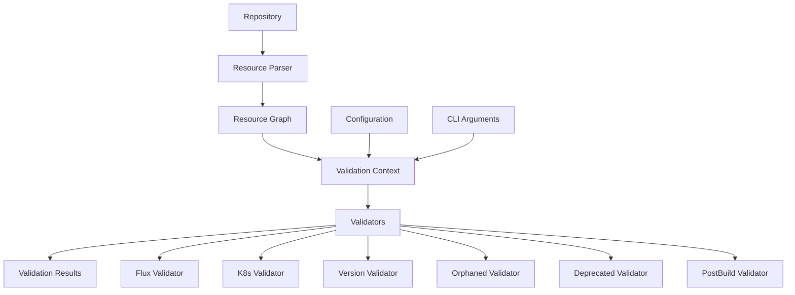

# GitOps Validator Architecture

## Overview

The GitOps Validator uses a modern graph-based architecture that provides efficient, scalable validation of GitOps repositories. This document describes the architecture, components, and design decisions.

## Architecture Principles

### 1. Graph-Based Resource Parsing
- **Single-Pass Parsing**: All YAML files are parsed once into a unified resource graph
- **Resource Relationships**: The graph captures dependencies and references between resources
- **Efficient Validation**: Validators consume the parsed graph instead of re-parsing files

### 2. Modular Validator Design
- **Unified Interface**: All validators implement the `GraphValidator` interface
- **Separation of Concerns**: Each validator focuses on a specific validation aspect
- **Composable Validation**: Complex validators can be composed from simpler ones

### 3. Context-Driven Validation
- **ValidationContext**: Provides centralized access to parsed resources and configuration
- **Graph Operations**: Context provides helper methods for common graph operations
- **Configuration Integration**: Seamless integration with validation configuration

## Core Components

### 1. Resource Parser (`internal/parser/`)
The parser is responsible for discovering and parsing all YAML files in the repository into a structured resource graph.

```go
type ResourceParser struct {
    repoPath string
    config   *config.Config
}

type ResourceGraph struct {
    Resources []*ParsedResource
    Files     []string
}
```

**Key Features:**
- Recursive directory traversal
- YAML document parsing
- Resource type detection
- Dependency extraction
- File relationship mapping

### 2. Validation Context (`internal/context/`)
The validation context provides a unified interface for validators to access parsed resources and perform common operations.

```go
type ValidationContext struct {
    Graph    *parser.ResourceGraph
    Config   *config.Config
    RepoPath string
    Verbose  bool
}
```

**Key Methods:**
- `FindEntryPoints()`: Discovers entry point resources
- `FindOrphanedResources()`: Identifies unreferenced resources
- `GenerateDependencyChart()`: Creates visualization charts
- `FindDoubleReferencedResources()`: Detects multiple references

### 3. Validator Interface (`internal/validators/interface.go`)
All validators implement a unified interface for consistency and testability.

```go
type GraphValidator interface {
    Name() string
    Validate(ctx *context.ValidationContext) ([]types.ValidationResult, error)
}
```

**Benefits:**
- Consistent validation interface
- Easy testing with mock contexts
- Simplified validator composition
- Clear separation of concerns

### 4. Resource Graph (`internal/parser/resource.go`)
The resource graph represents the parsed repository structure with relationships.

```go
type ParsedResource struct {
    File         string                 // Source file path
    Line         int                    // Line number in file
    APIVersion   string                 // apiVersion
    Kind         string                 // kind
    Name         string                 // metadata.name
    Namespace    string                 // metadata.namespace
    Content      map[string]interface{} // Full resource content
    Dependencies []ResourceReference    // What this resource references
    ReferencedBy []ResourceReference    // What references this resource
}
```

## Validator Types

### 1. Flux Kustomization Validator
Validates Flux Kustomization resources for:
- Path reference validity
- Source reference existence
- Relative path resolution

### 2. Kubernetes Kustomization Validator
A composite validator that includes:
- **Resource Validator**: Validates resource references
- **Patch Validator**: Validates patch references
- **Strategic Merge Validator**: Validates strategic merge patches

### 3. Version Consistency Validator
Ensures consistent `kustomize.config.k8s.io` apiVersions across dependency trees.

### 4. Orphaned Resource Validator
Identifies resources not referenced by any entry point using graph traversal.

### 5. Deprecated API Validator
Checks for usage of deprecated Kubernetes API versions.

### 6. PostBuild Variables Validator
Validates Flux postBuild substitute variable naming conventions.

## Data Flow



## Performance Characteristics

### Before Phase II (Legacy Architecture)
- Each validator parsed files independently
- Multiple file system traversals
- Redundant YAML parsing
- O(n×m) complexity where n = files, m = validators

### After Phase II (Graph-Based Architecture)
- Single file system traversal
- Single YAML parsing pass
- Shared resource graph
- O(n + m) complexity where n = files, m = validators

### Performance Benefits
- **Faster Execution**: ~3-5x improvement for large repositories
- **Lower Memory Usage**: Shared resource representation
- **Better Scalability**: Linear complexity growth

## Extension Points

### Adding New Validators
1. Implement the `GraphValidator` interface
2. Register the validator in the main validator
3. Add configuration options if needed
4. Update documentation

### Adding New Resource Types
1. Update the parser to recognize the new resource type
2. Add resource type constants
3. Update validators to handle the new type
4. Add tests for the new functionality

### Custom Validation Rules
1. Create validation rule structs
2. Implement rule validation logic
3. Compose rules into validators
4. Configure rule behavior

## Testing Strategy

### Unit Testing
- Mock validation contexts for validator testing
- Test individual validation rules
- Verify error handling and edge cases

### Integration Testing
- Test with real GitOps repositories
- Verify end-to-end validation flow
- Performance regression testing

### Configuration Testing
- Test different configuration combinations
- Verify backward compatibility
- Test error handling for invalid configs

## Migration Guide

See [MIGRATION_GUIDE.md](MIGRATION_GUIDE.md) for detailed migration instructions from the legacy architecture to the graph-based architecture.

## Future Enhancements

### Planned Features
- **Parallel Validation**: Run validators in parallel for better performance
- **Incremental Validation**: Only revalidate changed resources
- **Custom Validators**: Plugin system for custom validation logic
- **Validation Caching**: Cache validation results for unchanged resources

### Architecture Improvements
- **Resource Indexing**: Fast lookup structures for large repositories
- **Validation Pipelines**: Configurable validation execution order
- **Result Aggregation**: Advanced result filtering and grouping
- **Real-time Validation**: Watch mode for continuous validation
